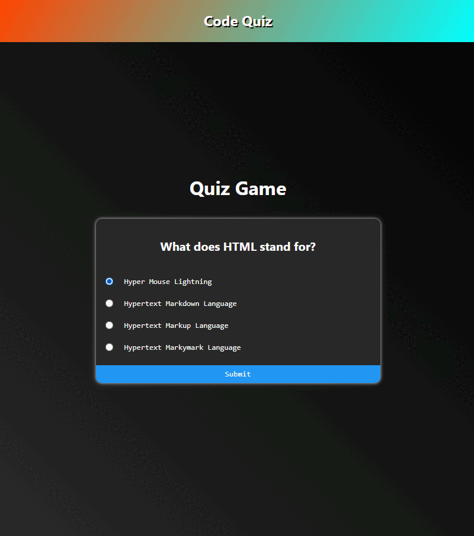

# Hi there 👋 

## This is a quiz app, it's built with react using tests 

The functionality is to use mockData, with questions and 4 alternatives / choices to choose from with only one being right for the current question, and 3 being wrong answers.
After the questions have all been submitted show a score and answers for which questions was correct or wrong

It's a basic create-react-app project and I've used basic jsx and sass for styling in this project 

All tests can be found in the /src/__test__ dir

# Components and Features to include 💾
- Header (with a title)
- Quiz component, handles state for currentQuiz, selectedAnswers and score, its is the wrapper for QuizHeader & QuizQuestions, passes the data
    - QuizHeader component is where the question is shown as title, passed in as props from data
    - QuizQuestion, handles submit and is a list wrapper for QuizChoices rendering the choices, passed in as props from data
- QuizChoice component should contain a choice ex, li with input and label, takes in props from data

// not ready yet...

### Getting started

```sh
npm run start
```

### How to run test 

```sh
npm run test
```

There should be data for this project and I'll give an example here, to make it easier.
But feel free to use what ever mockData you want. 
```
[
  {
    question: 'What does HTML stand for?',
    a: 'Hyper Mouse Lightning',
    b: 'Hypertext Markdown Language',
    c: 'Hypertext Markup Language',
    d: 'Hypertext Markymark Language',
    correct: 'c',
  },
  {
    question: 'What does CSS stand for?',
    a: 'Cool sassy style',
    b: 'Cascading sassy sheets',
    c: 'Cascading style sheets',
    d: 'Cascading sheets style',
    correct: 'c',
  },
  {
    question: 'Which language runs in the web browser?',
    a: 'JAVA',
    b: 'Python',
    c: 'C#',
    d: 'Javascript',
    correct: 'd',
  },
  {
    question: 'How does a computer understand javascript?',
    a: 'With the help of integers',
    b: 'With the help of vs code',
    c: 'With help of the web browser',
    d: 'With the help of a compiler',
    correct: 'd',
  },
  {
    question: 'When was the first workable internet tested?',
    a: '1980',
    b: '1960',
    c: '2000',
    d: '1990',
    correct: 'b',
  },
]
```

# PREVIEW
    This is just to help out for the process
### Survey App 



Happy coding 😊